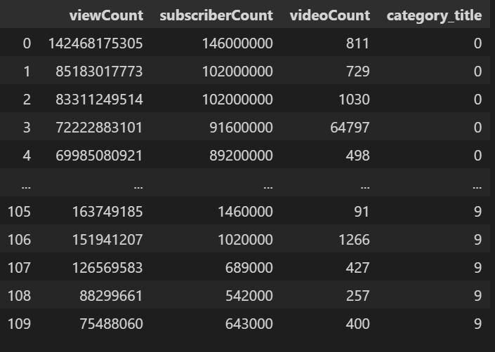

# Top_Youtube_Channels_Trend_Analysis

Image downloaded form : [How do youtube videos become trending?](https://medium.com/@melodyfs/how-do-videos-become-trending-on-youtube-2690a6622b7d)
## Overview

Our goal is to create a machine learning model that will be trained to predict whether or not a youtube video has the potential to be viral. This will be based on features which include amount of subscribers that channel has, total amount of views on the channel and video, which category the video belongs to, and total amount of likes on the video. From these features, we will have over 7,000 videos to train and test this algorithm on so the model can learn which features best predict if the video will be viral. We are basing the term viral as a video that gets over 1 million views. If the video can get over 5 million views than it will be given the value of 1 which equates to viral. If the video would get less than 1 million views then it would be given the value of 0, for not viral.

We chose 1 million views as our differentiating point of viral vs. not viral. Due to a growing number of Internet and social media users, while still a big achievement, reaching that mythical million is no longer as much of a challenge. There are simply too many videos with that many views to make them all stand out. It’s safe to assume that currently, it’s better to aim at gaining at least [1 million views](https://mint.intuit.com/blog/relationships/how-much-do-youtubers-make/) to reap the benefits of going viral. If you can get 1 million views on your video that is the equivialant to about $5,000. So, to answer the question of how many views is viral - there is no simple answer here. In reality, not all viral videos are created equal, so the more views you get, the better, but for our machine learning model's sake, we chose 1 million views. 

## Contributors: 
1. Zara Khan - zaraxkhan - Circle Role

2. Kevin MacDonald - macdkw89 - Triangle Role

3. Justin Tapia - justint42 - X Role

4. Snehal Desavale - SNEHALDD - Square Role

## Resources

1. Youtube v3 API (https://www.googleapis.com/youtube/v3)
    - All data used in this project is sourced directly from the Youtube API
    - API Resources used
      - Channels
      - Comments
      - CommentThreads
      - Videos

2. Dataset Category References: 
   1. [Best Youtube Channels for every category](https://blog.hubspot.com/marketing/best-youtube-channels)
      - Using this article, we obtained each channel listed under each category for our purposes
      - We opted to not use the "Yoga" category due to its similarity to the "Fitness" category.
   2. [List of most-subscribed YouTube channels - Wikipedia](https://en.wikipedia.org/wiki/List_of_most-subscribed_YouTube_channels)
      - Using this link, we sorted the table and grabbed the top 20 English Language channels by subscriber count for use in our analysis
      - There are a handful of duplicate channels in this data when compared to the categorical channel list mentioned above. Our analysis will drop these to avoid duplicate entries.

3. Software : 
    - Python 3.9.12
    - Scikit-learn 1.0
    - Numpy 1.21.5
    - pandas 1.4.2
    - psycopg2-binary-2.9.5
    - vaderSentiment - SentimentIntensityAnalyzer

4. Relational Database : PostgresSQL 11 connected to AWS database server. 

5. Tools / Software : Tableau public, git, pgAdmin, VS Code.

## Prerequisites

Before you begin, Please ensure you have met the following requirements:

You have installed updated version of Python, VS Code, and related dependencies   

You have PostgresSQL 11 installed. 

You have created a database in AWS. 

You have access to Tableau public. 

## Installation

## Machine Learning Model
We are using machine learning to see if we can predict what category a channel belongs to based on its subscriberCount, viewCount, and videoCount.

Features: viewCount, subscriberCount, videoCount
Targer variable: category_title

RandomForestClassifier

## Database Integration
We created a database in [Amazon Web Services](https://aws.amazon.com/) and connected the host,database, user, and password onto a new server on PostgreSQL. We created two tables, one which contains information regarding the 178 [channel data](https://raw.githubusercontent.com/SNEHALDD/Top_Youtube_Channels_Trend_Analysis/Zara/Database/ready_for_sql/channels_data.csv) and the other which contains information about the 50 videos we gathered from each channel, the [video data](https://raw.githubusercontent.com/SNEHALDD/Top_Youtube_Channels_Trend_Analysis/Zara/Database/ready_for_sql/video_data.csv). We joined these files on the primary key which is the channel_id. 

This [joined file](https://raw.githubusercontent.com/SNEHALDD/Top_Youtube_Channels_Trend_Analysis/main/Database/ready_for_sql/joined_data.csv) stores all the information we will need in order to begin to train our machine learning model and create the best visualizations possible. 

### ERD
Here is the [ERD](https://github.com/SNEHALDD/Top_Youtube_Channels_Trend_Analysis/blob/main/Database/ERD.png) visual which makes the connection of both tables that we joined together to create our final dataframe.

### Connecting to the database
As shown in this [file](https://github.com/SNEHALDD/Top_Youtube_Channels_Trend_Analysis/blob/Zara/Database/db_connection.ipynb), we will be using psycopg to connect our database that is currently stored in the cloud, to our python file in order to do our machine learning model. 

## Dashboard

### Tool : Tableau Public

We will add visualizations of:
- Total number of subscribers of the channel,
- Total number of views on the video,
- Total number of likes on the video.
- Total length of the video.
- Ratio of number of subscribers to number of views.

Interactive element(s):
- Dropdown menu which will list names of all the categories. Once you choose the category, dashboard will show above charts and information of videos.

## Contact 
If you want to contact us, you can reach us at

 zaraxkhan - [zxkhan.99@gmail.com](mailto:zxkhan.99@gmail.com)

 macdkw89 - [macdkw@gmail.com](mailto:macdkw@gmail.com) 

 justint42 - [tapiajustin42@gmail.com](mailto:tapiajustin42@gmail.com)

 SNEHALDD - [snehaldesavle3@gmail.com](mailto:snehaldesavle3@gmail.com)
